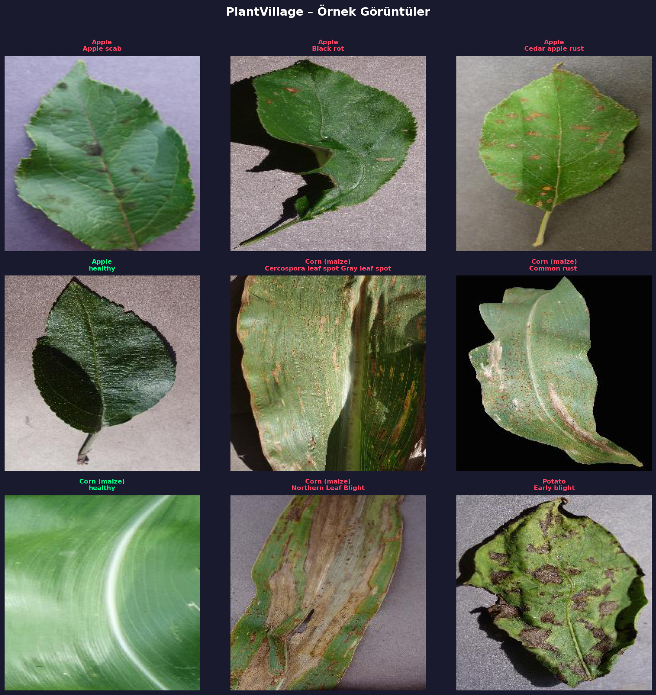
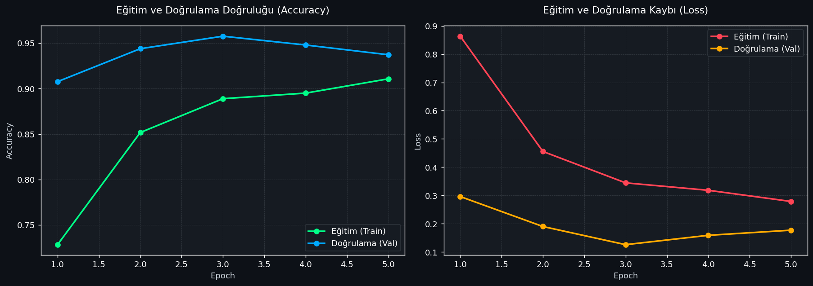

# 🌱 Tarım Yapay Zekası 

> **Doç. Dr. Yusuf Uzun rehberliğinde yürütülen Derin Öğrenme Dersi Final Projesi**

Gelişen teknolojiyle birlikte tarım sektöründe verimliliği artırmak ve ürün kayıplarını en aza indirmek kritik bir önem taşıyor. **Tarım Yapay Zekası**, çiftçilerin ve ziraat mühendislerinin bitkilerdeki hastalıkları erken, hızlı ve yüksek doğrulukla teşhis edebilmesi için geliştirilmiş, Derin Öğrenme tabanlı bir görüntü sınıflandırma projesidir.

Bu proje, açık kaynaklı *PlantVillage* veri setini kullanarak 21 farklı bitki/hastalık sınıfını otomatik olarak tanıyabilen bir yapay zeka modeli sunar.

## 🎯 Proje Amacı

Bitki hastalıklarının manuel olarak teşhis edilmesi zaman alıcıdır ve uzmanlık gerektirir. Yanlış veya geç teşhis, tüm hasadın kaybedilmesine yol açabilir. Bu sistem sayesinde:
- Kullanıcılar sadece bir bitki yaprağının fotoğrafını çekerek veya yükleyerek analiz yapabilir.
- Model saniyeler içinde hastalığın türünü belirler.
- Kullanıcı dostu çıktı mekanizması ile hastalığın adını net bir şekilde sunar.

### 🖼️ Veri Setinden Örnekler


## 🚀 Model Başarısı

Projede Transfer Learning tekniği ile **EfficientNet-B0** mimarisi kullanılmıştır.

- **Veri Seti:** PlantVillage 
- **Doğrulama Başarısı:** **%95.77** 🏆
- **Optimizasyon:** Veri artırma ve %50 Dropout uygulanarak modelin aşırı öğrenmesi başarılı bir şekilde engellenmiştir.

### 📈 Eğitim ve Doğrulama Grafikleri


## 🛠️ Kullanılan Teknolojiler

- **[PyTorch](https://pytorch.org/)**: Derin öğrenme modelinin oluşturulması ve eğitimi.
- **CUDA**: Model eğitiminde GPU hızlandırması.
- **[Torchvision](https://pytorch.org/vision/stable/index.html)**: Görüntü işleme ve model mimarileri.
- **Python**: Temel geliştirme dili.
- **Kaggle API**: Veri setinin otomatik olarak indirilmesi.


## 📁 Proje Yapısı

```
Tarim_Yapay_Zekasi/
│
├── data_preparation.py  # Kaggle'dan veri setini indirir ve hazırlar.
├── train_model.py       # Modeli eğitir, grafikler çizer ve ağırlıkları kaydeder.
├── predict.py           # Eğitilmiş modeli kullanarak tahmin yapar.
├── models/              # Eğitilmiş model dosyaları (.pth) bu klasörde tutulur.
├── reports/             # Eğitim sürecine ait doğruluk/kayıp grafikleri.
└── kaggle.json          # Veri seti indirmek için gerekli Kaggle kimlik bilgisi.
```

## ⚙️ Kurulum ve Çalıştırma

### 1. Gereksinimleri Yükleyin
Projenin çalışması için PyTorch ve ilgili kütüphanelerin sisteminizde kurulu olması gerekmektedir:
```bash
pip install torch torchvision torchaudio --index-url https://download.pytorch.org/whl/cu118
pip install kaggle matplotlib pillow
```

### 2. Veri Setini Hazırlama
Kaggle API anahtarınızın (`kaggle.json`) ana dizinde olduğundan emin olduktan sonra veri setini indirin:
```bash
python data_preparation.py
```
*Bu betik PlantVillage veri setini indirecek ve ilgili klasörlere çıkartacaktır.*

### 3. Model Eğitimi 
Sıfırdan kendi modelinizi eğitmek isterseniz:
```bash
python train_model.py
```
*Eğitim tamamlandığında en iyi model `models/best_model.pth` olarak kaydedilir ve performans grafikleri `reports/` klasörüne aktarılır.*

### 4. Tahmin Yapma 
Modeli test etmek için `predict.py` dosyasını kullanabilirsiniz. Belirli bir resim vermek için:
```bash
python predict.py --image "test_resim.jpg"
```
Herhangi bir resim belirtmezseniz, betik otomatik olarak veri setinden **rastgele** bir resim seçecek ve İngilizce sınıf adlarını Türkçeye çevirerek şu şekilde temiz bir çıktı sunacaktır:

```
======================================================================
  🌱 TARIM YAPAY ZEKASI - MODEL TEST VE TAHMİN
======================================================================
[BİLGİ] Kullanılan Donanım: CUDA
[BİLGİ] Seçilen Resim: 397ffe67-e784-44d5-ae1a.JPG
[BİLGİ] Gerçek Sınıfı: DOMATES - ERKEN YANIKLIK
----------------------------------------------------------------------
🎯 Tahmin: DOMATES - ERKEN YANIKLIK (Güven Oranı: %99.92)
----------------------------------------------------------------------
```

---
*Bu proje Tarım Teknolojilerine katkı sağlamak amacıyla açık kaynaklı olarak **Hasan Köstek** tarafından geliştirilmiştir.*
